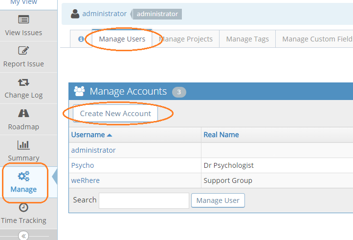
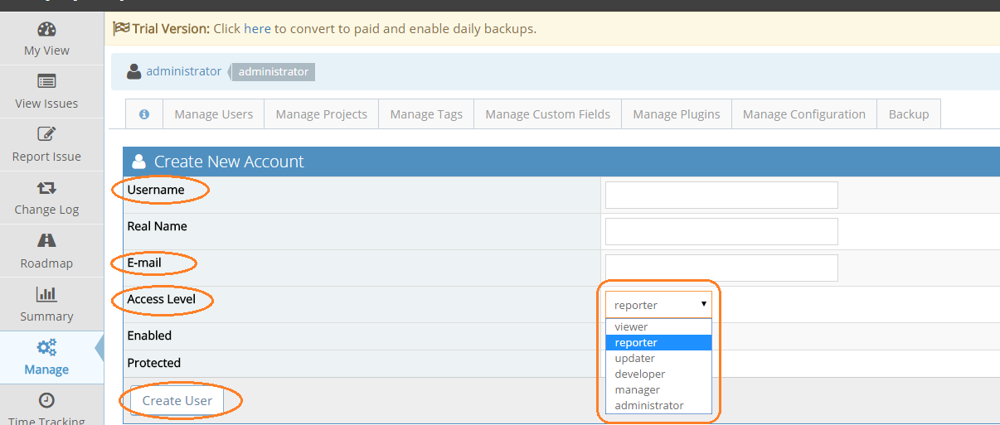
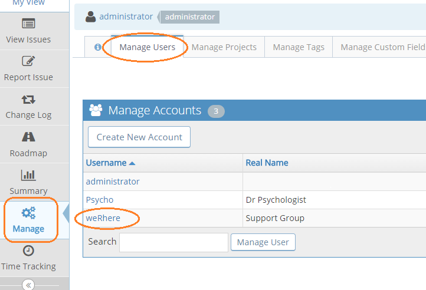
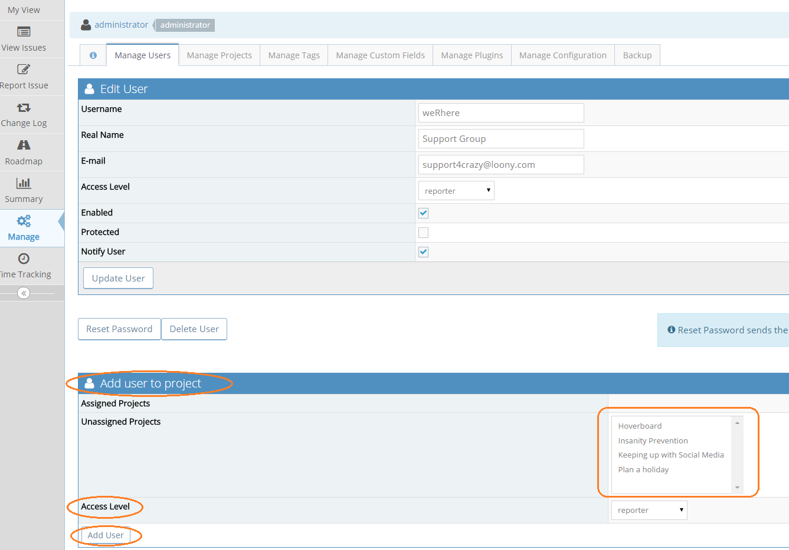

# Creating User Accounts

[Video Tutorial](https://youtu.be/mjlNZ9jlBHY)

<iframe width="560" height="315" src="https://www.youtube.com/embed/mjlNZ9jlBHY?si=ZAVBVxaIA1oIelvd" title="YouTube video player" frameborder="0" allow="accelerometer; autoplay; clipboard-write; encrypted-media; gyroscope; picture-in-picture; web-share" referrerpolicy="strict-origin-when-cross-origin" allowfullscreen></iframe>

Administrators have access to create new user accounts. The steps to do that are:

- Click "Manage" on Main Menu.
- Click "Manage Users".
- Click "Create New Account" button.

- Enter user name, email address, global access level (more details about access levels later). Other fields are optional.
- Click “Create Users” button.

When the ‘Protected’ flag is set on a user account, it indicates that the account is a shared account and hence users logged using such account will not be allowed to change account preferences and profile information.

Creating a user triggers the following actions:

- Creates a user in the database.
- An email notification is sent to the created user enabling them to activate their account and set their password. The invitation link in this email will expire within **30 days** after which the link will no longer work and a password reset may be required.
- Administrators will receive a notification that a new user has been created. Information about the user like user name and email address are provided. The IP address of the user that created the account is also included.

When users are created, they get access to all "public" projects by default.  However, if they should have access to "private" projects or have a different access level to a specific project compared to their default access level, then they should be explicitly added.

- Click "Manage" on Main Menu.
- Click "Manage Users".
- Click on the username in the displayed list.

- Go to "Add user to project" section.
- Select the projects to give them access to.
- Select the access level to grant them.
- Click "Add User"

