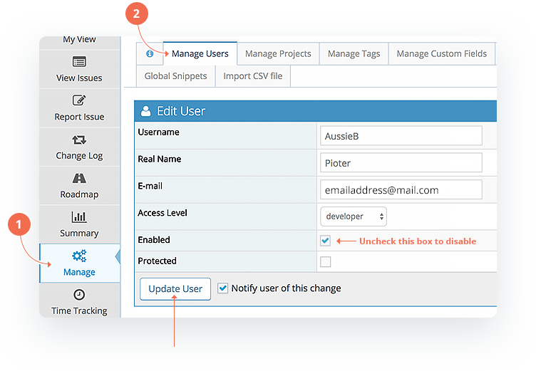

# Disabling User Accounts

The recommended way of retiring user accounts is to disable them. Scenarios where this is useful is when a person leaves the team and it is necessary to retire their account.

Once an account is disabled the following will be enforced:

- All currently active sessions for the account will be invalidated (i.e. automatically logged out).
- It will no longer be possible login using this account.
- No further email notifications will be sent to the account once it is disabled.
- The user account will not show anymore in lists like “assign to”, “send reminder to”, etc.
- The user will NOT count toward your plans user allowance. 

To disable users, go to '*Manage*' - '*Manage Users*' and click on the hyperlink of the username you wish to disable. Then simply untick the Enabled check box and click '*Update User*'. 

The disabling process is totally reversible. Hence, the account can be re-enabled and all the account history will remain intact. For example, the user will still have issues reported by them, assigned to them, monitored by them, etc. Disabled users do not count towards your plan limit. Once they are re-enabled, however, they will once more be included in your plan active user count. 