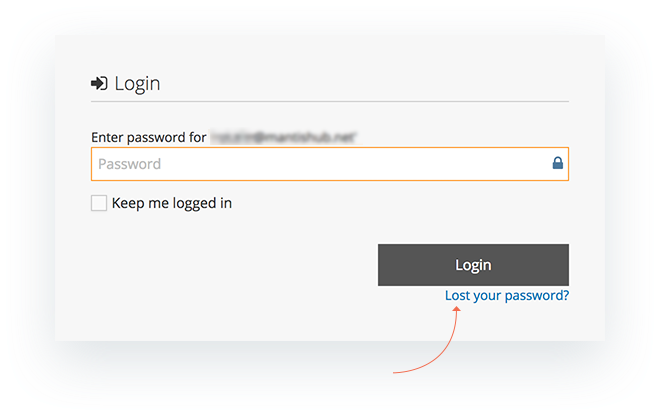
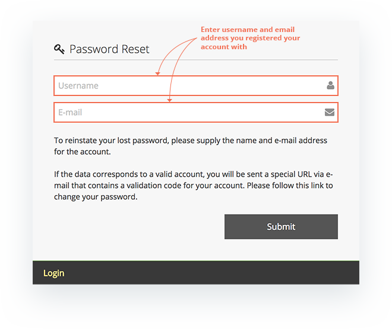
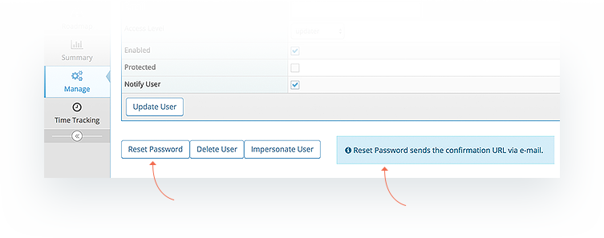

# Forgot/Reset Password

It is pretty common for users to forget their password. MantisHub provides two ways to handle such scenario: "Forgot Password" and "Reset Password". Alternatively, you can also access your MantisHub [using single sign-on](/plug_ins/config_authhub) with supported vendor accounts.

**Forgot MantisHub Password (Self-Service)**

"Forgot Password" is a self service scenario.  Users go to the login page, enter their username or email address and select 'Login'. If they do not remember their password they can click the 'Lost your password?' link.

Users are then asked for their username and email address.  If correct, they are sent an email with a link which allows them to login to MantisHub and change their password.

**Reset MantisHub User Password (by administrator)**

"Reset Password" scenario is where a user reports to the administrator that they are not able to login into MantisHub. This can be due to forgetting their password and possibly username or email address that they used when signing up.

The administrator will need to go to 'Manage' - 'Manage Users'  and select the user. Then they will click 'Reset Password'. This will trigger an email to the user to allow them to get into MantisHub and set their password.

Note: The primary account holder's username will always be 'administrator' unless specifically changed by the user. 

 If you find the user is not receiving their reset email, be sure to check spam/junk/clutter folders and make sure the email address entered is correct. You can also turn on the [Event Log](/system_management/event_log_email_notifs) for some diagnostic information. 